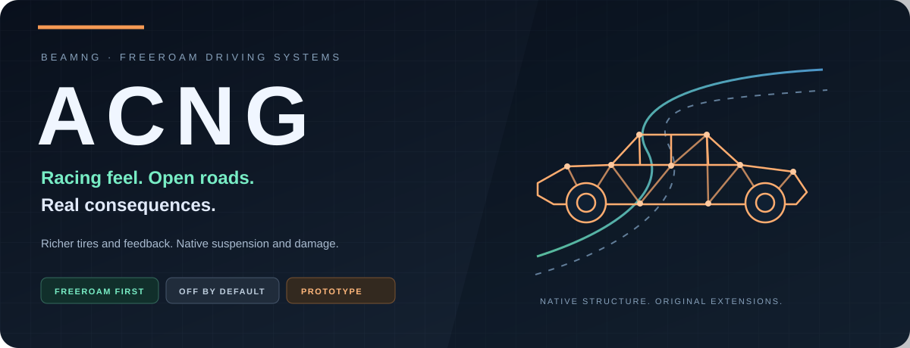
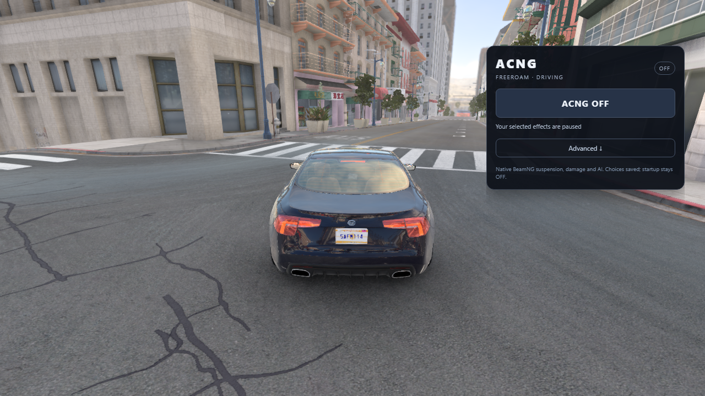

<div align="center">



**Assetto Corsa-inspired driving. BeamNG's living, breakable chassis.**

[Start driving](#start-driving) · [Features](#what-you-can-use-today) · [Evidence](#measured-progress) · [Roadmap](docs/ROADMAP.md) · [Architecture](docs/ARCHITECTURE.md)

**FREEROAM FIRST** · **MODULAR** · **OFF BY DEFAULT** · **EARLY PROTOTYPE**

</div>

## The idea

Bring richer tires, useful driving feedback and motorsport instruments to the
streets of BeamNG. Let temperature and wear matter. Keep the car's native suspension,
collisions, deformation and mechanical damage in charge.

Assetto Corsa is a behavioral reference. ACNG is an original BeamNG mod: no merged
engines or redistributed game assets. Native BeamNG traffic and AI stay native.
The current focus is open-world driving; deeper racing systems come later.

## One switch. Your setup.



Use the **ACNG** master switch for the whole mod. Open **Advanced** for individual
tire, assist, wheel and telemetry controls. Choices are remembered; a new game
starts OFF. Master OFF stops active ACNG modules and its telemetry stream.

## What you can use today

| System | What it adds | Verification |
|---|---|---|
| **Road / Sport tires** | Native heat/pressure, temperature-driven grip, selectable presets | Short native thermal comparisons; experimental compound settings |
| **Tire wear** | Slip-driven tread loss and grip changes; fresh tread on reset | Controlled-circle tests; wider road validation pending |
| **ABS / traction control** | Factory, Off or three intervention levels | Native tests; throttle-cut TC for cars without factory TC |
| **Force feedback** | Strength, per-car gain, minimum force, filtering and optional effects | Virtual-wheel tests; real wheel and road/kerb feel pending |
| **Driving instruments** | Gear/speed/RPM HUD, pedals, acceleration and braking timers | Native HUD/timing evidence |
| **Optional lap tools** | Delta, sectors and saved best-lap references | Native timing/persistence evidence |
| **Pit service (optional)** | Timed refuel and fresh ACNG tread at a marked pit box; damage and punctures stay | Native P001b/P001c; Spa pit lane P002 |
| **Telemetry** | Passive BeamNG capture and local AC shared-memory research | Machine-readable capture/comparison tooling |

FFB requires a force-feedback wheel; it does not change keyboard/gamepad steering.
Pressure currently follows heat. Presets do not detect every car's real tire compound.

## Measured progress

**164 Python checks + 6 Node app suites passed locally.**
**Native in-game checks in BeamNG 0.39.4, all in isolated profiles:**

- Six stock models (FWD, RWD, 3-wheel, van, 10-tire semi) driven, crashed,
  punctured and run on a broken-off wheel: 110/110. Master OFF never repairs damage;
  reset repairs and gives fresh tread.
- Sustained limit driving (16 lap cycles): Road preset +1.7 psi with flat 50 °C peaks;
  Sport +8.5 psi.
- Pit service 13/13, control panel, presets, saved preferences, lap timer and
  car switching/reset checks.

| Short road-speed proxy | Peak tire surface | Largest pressure rise |
|---|---:|---:|
| Previous Sport heat setup | 51.75°C | +0.64 psi |
| Final Road preset | 33.87°C | +0.29 psi |

Single short flat-map runs on one ETK configuration. They show a gentler thermal
response, not AC-equivalent handling, real-compound accuracy or a fix for sustained
pressure rise. Native rolling/deformation also affects pressure.

[Thermal evidence and limits](docs/test-results/FR001-thermal-proxy.md) ·
[Compatibility checks](docs/test-results/GUI002-FR002-road-compatibility.md) ·
[FFB evidence](docs/test-results/T008-ffb.md)

## Start driving

Requires your own BeamNG.drive installation. Tested on **0.39.4**; other builds
and third-party vehicles need verification. Use an isolated profile while experimental.

**Easiest:** open [Releases](https://github.com/AGames21/ACNG/releases/latest)
and download `acng-freeroam.zip`. No Python or Git needed.

**Or build it yourself:**

```sh
git clone https://github.com/AGames21/ACNG.git
cd ACNG
python tools/build_freeroam.py
```

1. With BeamNG closed, place `acng-freeroam.zip` (from Releases or `dist/`) in your
   BeamNG user folder's `mods` directory. On Windows that is
   `%LOCALAPPDATA%\BeamNG\BeamNG.drive\current\mods`; the BeamNG launcher's
   "Open user folder" button finds it on any PC.
   Keep only one enabled ACNG package; disable older copies.
2. In **UI Apps**, add **ACNG**, spawn a stock vehicle and turn the master ON.
3. Under **Advanced → Tires**, select **Road** or **Sport**. Reset for fresh tires
   when comparing presets; switching alone retains current heat/tread.

First ON selects heat/wear, keeps factory assists and leaves optional FFB OFF.
The ZIP excludes unfinished racing modules and test harnesses.
Disable/remove ACNG through BeamNG's mod manager to remove the independent mod files.

[Freeroam guide](docs/FREEROAM.md) · [Testing guide](docs/TESTING.md)

## What's next

- **Road calibration:** city stops, cruising, winding roads and sustained-load pressure.
- **Compatibility:** more cars/custom parts, bent suspension and performance profiling.
- **Wheel feel:** physical FFB testing with targeted driver feedback.
- **Freeroam extras:** investigate roadside tire service, compounds and compact tire status.
- **Track later:** sessions, pits, penalties and environment research after reliable driving.

Race Weekend is an unfinished prototype excluded from the player ZIP. No automatic
opponent spawning in the freeroam experience.

## Inside ACNG

```text
beamng-mod/   Independent Lua extensions, UI apps and settings
telemetry/    Capture, normalization and comparison tools
tests/        Offline contracts and isolated native-game harnesses
scripts/      Deployment, launchers and experiment analysis
tools/        Packaging and publication checks
docs/         Architecture, research, benchmarks and evidence
```

Code/configuration/evidence belong in Git. Private paths, game profiles, credentials,
logs and raw capture runs stay ignored. Contributors and coding agents should read
[AGENTS.md](AGENTS.md) before making changes.

## Report something useful

Include your game build, car/configuration, selected effects, reproduction steps,
and whether it also happens with master OFF. Remove personal paths from log excerpts.

Offline/single-player modding only. No proprietary code, extracted models, textures,
sounds or binaries belong here. Unofficial and unaffiliated with BeamNG or Assetto
Corsa. Code is MIT licensed ([LICENSE](LICENSE)); BeamNG, Assetto Corsa and any maps or cars stay under their owners' terms.

### Optional Spa and pit development

An opt-in pit service adds timed refueling and intact-tire ACNG tread refresh to Advanced > Pits. It passed in game (P001b/P001c) and on the user's own Spa download (P002). Spa stays a separate author-distributed map; download it from its author on each PC. See [Spa and pit development](docs/SPA-AND-PITS.md).

A personal converter turns your own Assetto Corsa BMW 1M into a drivable BeamNG car on fitted ETK physics with native damage (C001/C002). It adds separate interior pieces, moving steering/pedals/shifter and an experimental specification config; C002 passed 34 native checks. This is an approximation, not a complete BMW chassis or AC handling port. The car contains AC and BeamNG assets, so it is never in this repository or its Releases. On another PC with both games installed, rebuild it there with one command. See [AC car conversion](docs/AC-CAR-CONVERSION.md).
